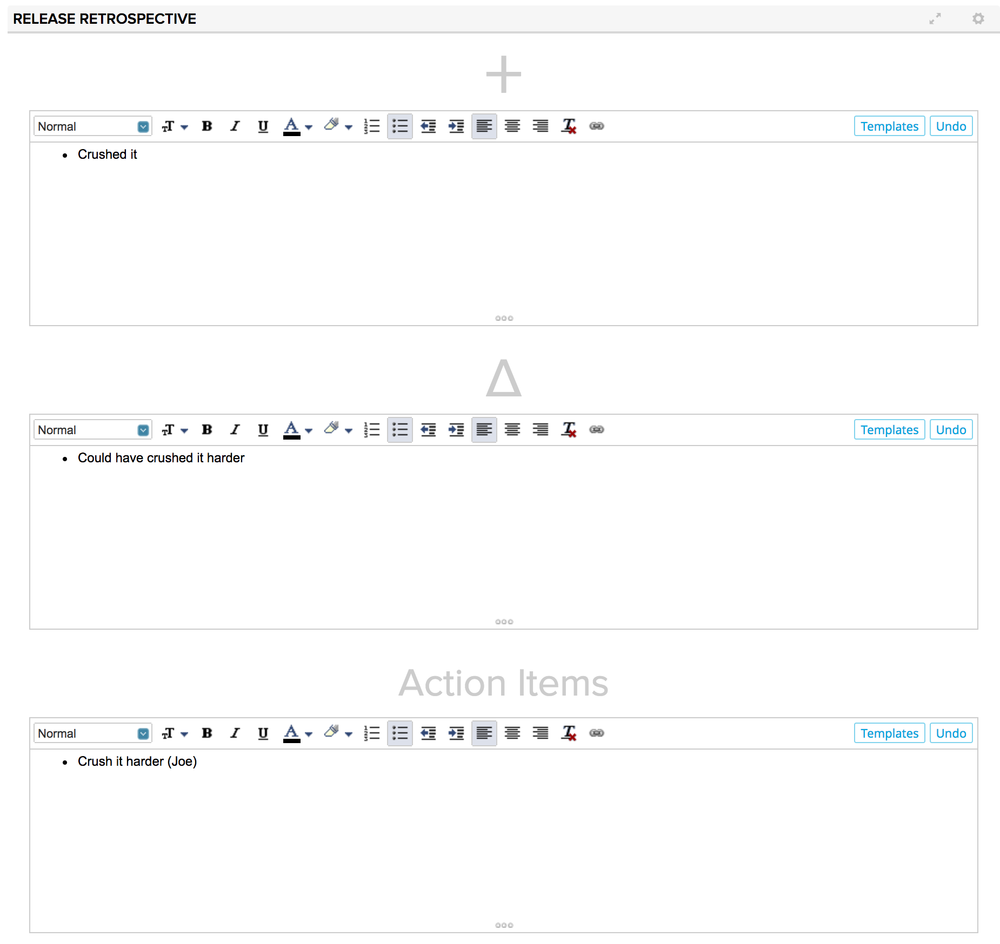
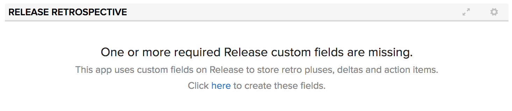
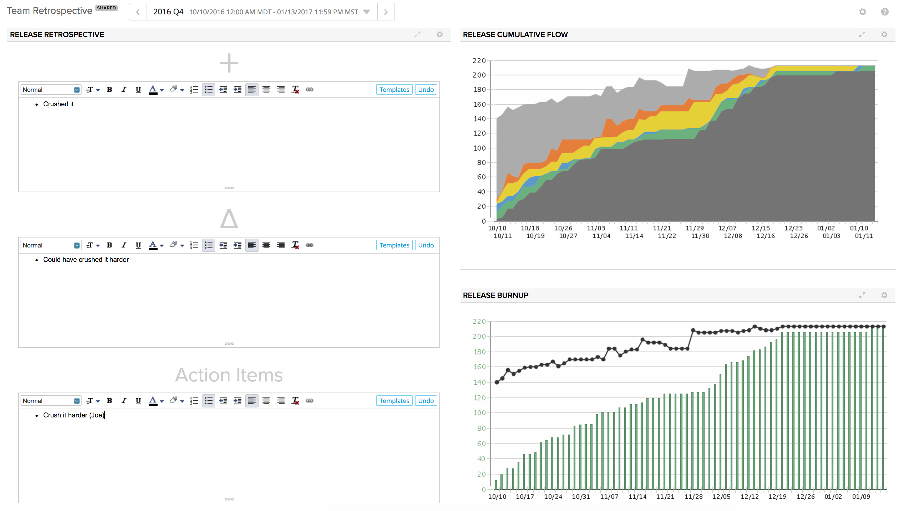

# Release Retrospective
An app to facilitate retrospective conversations within Agile Central.  Retrospectives are a critical ceremony for agile and lean methodologies.  This app tracks pluses, deltas and action items for each release using custom text fields on the Release object.  Say goodbye to external spreadsheets- now you can retro without leaving the tool!

## Installation
The app is installed as a Custom HTML App ([see help documentation](https://help.rallydev.com/custom-html))

When the app is installed the first time it will prompt to create the necessary custom fields on the Release object.

## Usage

The app is the most useful when installed on an release scoped custom page.  Flip between releases using the global release filter.
Enter your pluses, deltas and action items for the last release.  All the data is stored in Agile Central and is available via WSAPI and anywhere else you can view releases- custom lists, the timeboxes page, detail pages, editors, etc.

## Pro Tip

You can even add other apps to the page to seed the retro conversation with some context on how everything went.  Here is an example page which includes the Release Cumulative Flow app and a Release Burnup app as well.

